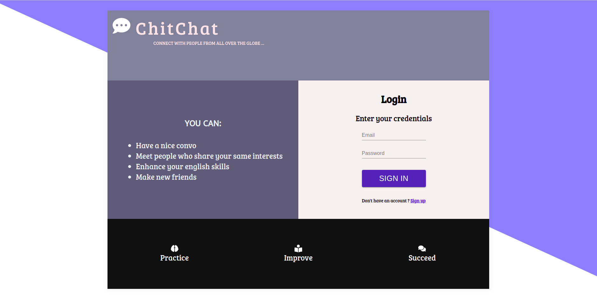

# Chitchat
A chat application

This project is a practice about a chat site intended for those who want to improve their writing english skills by sharing 
anecdotes, experiences and ideas with other people in a fun way.

For the time being, the application lets you:

<ul>
<li>Sign up by creating a new account.</li>
<li>Log yourself in.</li>
<li>Send and receive messages to an unique existing room.</li>
<li>Access via web, tablet or mobile browser.</li>
</ul>

Regarding the techs involved in its development, the following tools were used:

<ul>
<li>Parcel as a web bundler.</li>
<li>React as the UI library ( with hooks ).</li>
<li>CSS grid and Flexbox as layout systems.</li>
<li>Express and GraphQL as backend.</li>
<li>MongoDB as data storage.</li>
</ul>

For further information you can clone the project, this is a screenshot of the application:


<p align="center">
  
</p>


## How to run it ?

First, as usual clone the repo:

```console
foo@bar:~$ git clone https://github.com/wwleak/chitchat.git
```

Then install all the dependencies for server and client

```console
foo@bar:~$ npm i && cd client && npm i
```
And last but not least start the application

```console
foo@bar:~$ npm start
```
